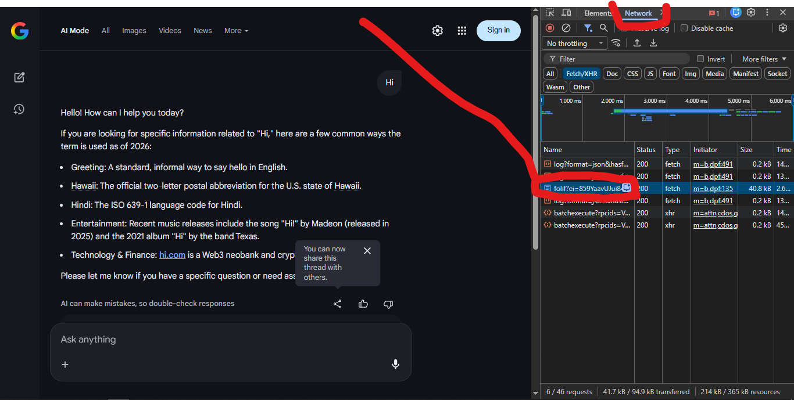
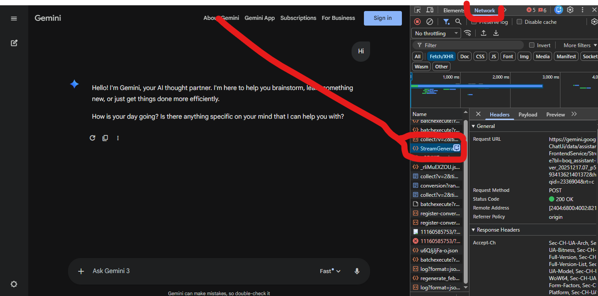
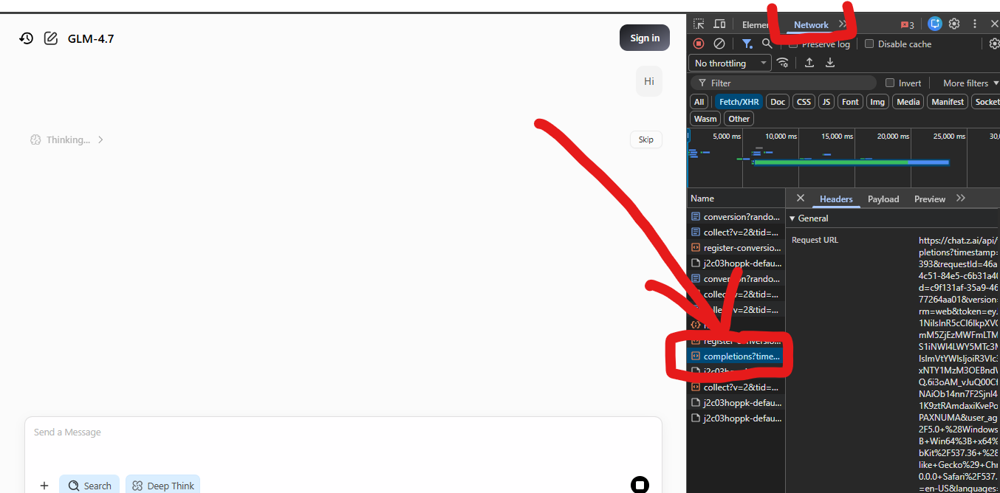

# AI Reverse Engineering CLI

This project contains a collection of Python scripts to interact with various AI models (Google AI, Gemini, Z.AI) directly from your terminal. It works by "reverse engineering" the browser requests, essentially acting as a headless browser to send your queries and retrieve responses.

## Prerequisites

- Python 3.x
- `pip` (Python package installer)

## Installation

1.  **Clone this repository** (or download the files).
2.  **Install dependencies**:
    You will need `requests` and `beautifulsoup4`.
    ```bash
    pip install requests beautifulsoup4
    ```

## Usage Guide

The general concept for all bots is the same:
1.  Navigate to the AI's website in your browser.
2.  Perform a search/chat to generate a network request.
3.  Copy that request as a cURL (bash) command.
4.  Paste it into the configuration file for the respective bot.
5.  Run the chatbot script.

### 1. Google AI (Search/Overview)

This bot interacts with Google's AI Overview or standard Search.

**Setup Loop:**

1.  Open **[Google](https://www.google.com)** in your browser (Chrome/Edge recommended).
2.  Open **Developer Tools** (Press `F12` or Right Click -> Inspect).
3.  Go to the **Network** tab.
4.  Type a query into Google (e.g., "Hello world").
5.  Look for a network request in the list. It often starts with `folif?`, `search?`, or has a long string of characters. It is usually a `fetch` or `xhr` type.
6.  Right-click the request -> **Copy** -> **Copy as cURL (bash)**.
    
7.  Paste the content into the file: `google-/curl` (Note: this file has no extension).
8.  Run the bot:
    ```bash
    cd google-
    python chatbot.py
    ```

### 2. Gemini

This bot interacts with Google DeepMind's Gemini.

**Setup Loop:**

1.  Go to **[Gemini](https://gemini.google.com)**.
2.  Open Developer Tools (`F12`) -> **Network** tab.
3.  Send a message to Gemini.
4.  Look for the `batchexecute` (or similar) request.
5.  Right-click -> **Copy** -> **Copy as cURL (bash)**.
    
6.  Paste the content into the file: `gemini-rev-script/curl.txt`.
7.  Run the bot:
    ```bash
    cd gemini-rev-script
    python chatbot.py
    ```

### 3. Z.AI

This bot interacts with Z.AI.

**Setup Loop:**

1.  Go to **[Z.AI](https://z.ai)** (or the specific platform URL).
2.  Open Developer Tools (`F12`) -> **Network** tab.
3.  Chat with the bot.
4.  Find the relevant POST/GET request used for the chat.
5.  Right-click -> **Copy** -> **Copy as cURL (bash)**.
    
6.  Paste the content into the file: `zai-rev/curl.txt`.
7.  Run the bot:
    ```bash
    cd zai-rev
    python chatbot.py
    ```

## Troubleshooting

-   **400/403 Errors**: Your session (cookies/tokens) has likely expired. Repeat the "Copy as cURL" steps to update your credentials.
-   **No Response/Empty Output**: The incorrect network request might have been copied. Ensure you copy the request that actually carries the chat payload (often distinct by its size or name like `batchexecute`).
-   **Dependencies**: Ensure `requests` and `bs4` are installed (`pip install requests beautifulsoup4`).

## Directory Structure

-   `google-/`: standard Google Search/AI Overview bot.
-   `gemini-rev-script/`: Gemini web interface bot.
-   `zai-rev/`: Z.AI bot.
